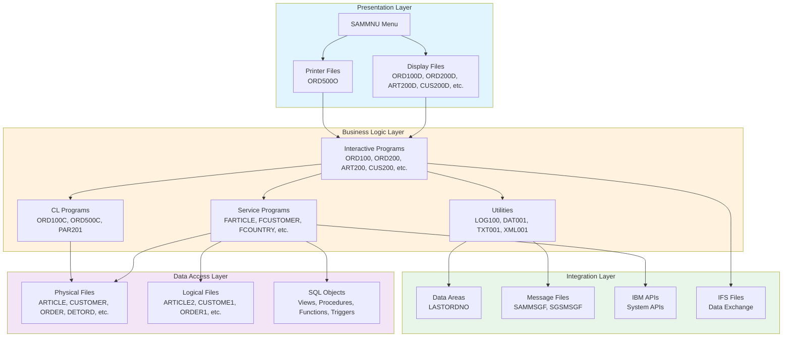
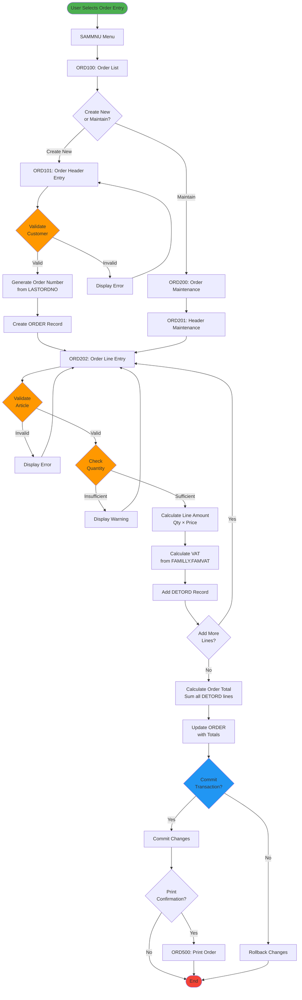
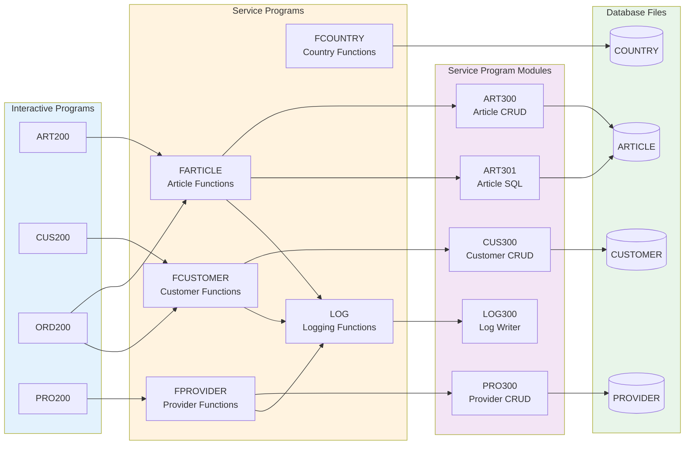

# SAMCO Application - Comprehensive Architecture Documentation

## Table of Contents
1. [Executive Summary](#executive-summary)
2. [Database Schema](#database-schema)
3. [Application Architecture](#application-architecture)
4. [Business Functions and Workflows](#business-functions-and-workflows)
5. [Technical Architecture](#technical-architecture)
6. [Integration Points](#integration-points)
7. [Mermaid Diagrams](#mermaid-diagrams)

---

## 1. Executive Summary

The SAMCO application is a comprehensive business management system built on IBM i platform, implementing a traditional 3-tier architecture with green-screen interfaces. The system manages core business operations including:

- **Order Management**: Complete order lifecycle from creation to fulfillment
- **Inventory Control**: Article/product management with provider relationships
- **Customer Management**: Customer master data and relationship tracking
- **Master Data Management**: Countries, families, parameters, and reference data

### Key Statistics
- **9 Physical Files** (Database Tables)
- **6 Logical Files** (Database Views/Indexes)
- **40+ RPG Programs** (Business Logic)
- **15+ Display Files** (User Interface)
- **Multiple Service Programs** (Reusable Components)

---

## 2. Database Schema

### 2.1 Core Physical Files (Tables)

#### ARTICLE (Article/Product Master)
**Purpose**: Central product catalog with pricing and inventory information

| Field | Type | Length | Description |
|-------|------|--------|-------------|
| ARTNUM | CHAR | 15 | Article Number (Primary Key) |
| ARTDES | CHAR | 50 | Article Description |
| ARTPRI | PACKED | 9,2 | Unit Price |
| ARTQTY | PACKED | 7,0 | Quantity in Stock |
| ARTFAM | CHAR | 3 | Family Code (FK to FAMILLY) |
| ARTUNI | CHAR | 3 | Unit of Measure |
| ARTSTA | CHAR | 1 | Status (A=Active, I=Inactive) |

**Relationships**:
- Links to FAMILLY via ARTFAM
- Links to DETORD (order details)
- Links to ARTIPROV (article-provider relationship)

#### CUSTOMER (Customer Master)
**Purpose**: Customer information and contact details

| Field | Type | Length | Description |
|-------|------|--------|-------------|
| CUSNUM | PACKED | 6,0 | Customer Number (Primary Key) |
| CUSNAM | CHAR | 50 | Customer Name |
| CUSAD1 | CHAR | 50 | Address Line 1 |
| CUSAD2 | CHAR | 50 | Address Line 2 |
| CUSCIT | CHAR | 30 | City |
| CUSZIP | CHAR | 10 | Postal Code |
| CUSCOU | CHAR | 3 | Country Code (FK to COUNTRY) |
| CUSTEL | CHAR | 20 | Telephone |
| CUSEMA | CHAR | 50 | Email |
| CUSSTA | CHAR | 1 | Status |

**Relationships**:
- Links to COUNTRY via CUSCOU
- Links to ORDER via CUSNUM

#### ORDER (Order Header)
**Purpose**: Order header information

| Field | Type | Length | Description |
|-------|------|--------|-------------|
| ORDNUM | PACKED | 7,0 | Order Number (Primary Key) |
| ORDCUS | PACKED | 6,0 | Customer Number (FK to CUSTOMER) |
| ORDDAT | PACKED | 8,0 | Order Date (YYYYMMDD) |
| ORDSTA | CHAR | 1 | Order Status |
| ORDTOT | PACKED | 11,2 | Order Total Amount |
| ORDVAT | PACKED | 11,2 | VAT Amount |
| ORDREM | CHAR | 100 | Remarks |

**Relationships**:
- Links to CUSTOMER via ORDCUS
- Links to DETORD (order lines)

#### DETORD (Order Detail/Lines)
**Purpose**: Individual line items within orders

| Field | Type | Length | Description |
|-------|------|--------|-------------|
| DETORD | PACKED | 7,0 | Order Number (FK to ORDER) |
| DETLIN | PACKED | 3,0 | Line Number |
| DETART | CHAR | 15 | Article Number (FK to ARTICLE) |
| DETQTY | PACKED | 7,2 | Quantity Ordered |
| DETPRI | PACKED | 9,2 | Unit Price |
| DETAMT | PACKED | 11,2 | Line Amount |
| DETVAT | PACKED | 11,2 | VAT Amount |

**Primary Key**: DETORD + DETLIN

**Relationships**:
- Links to ORDER via DETORD
- Links to ARTICLE via DETART

#### FAMILLY (Product Family/Category)
**Purpose**: Product categorization and grouping

| Field | Type | Length | Description |
|-------|------|--------|-------------|
| FAMCOD | CHAR | 3 | Family Code (Primary Key) |
| FAMDES | CHAR | 50 | Family Description |
| FAMVAT | PACKED | 5,2 | Default VAT Rate |

**Relationships**:
- Links to ARTICLE via FAMCOD

#### COUNTRY (Country Master)
**Purpose**: Country reference data

| Field | Type | Length | Description |
|-------|------|--------|-------------|
| COUCOD | CHAR | 3 | Country Code (Primary Key) |
| COUDES | CHAR | 50 | Country Description |
| COUCUR | CHAR | 3 | Currency Code |

**Relationships**:
- Links to CUSTOMER via COUCOD

#### ARTIPROV (Article-Provider Relationship)
**Purpose**: Many-to-many relationship between articles and providers

| Field | Type | Length | Description |
|-------|------|--------|-------------|
| APIART | CHAR | 15 | Article Number (FK to ARTICLE) |
| APIPRO | PACKED | 6,0 | Provider Number (FK to PROVIDER) |
| APIPRI | PACKED | 9,2 | Provider Price |
| APISTA | CHAR | 1 | Status |

**Primary Key**: APIART + APIPRO

#### PARAMETER (System Parameters)
**Purpose**: Application configuration and settings

| Field | Type | Length | Description |
|-------|------|--------|-------------|
| PARKEY | CHAR | 20 | Parameter Key (Primary Key) |
| PARVAL | CHAR | 100 | Parameter Value |
| PARDES | CHAR | 100 | Parameter Description |

### 2.2 Logical Files (Views/Indexes)

#### ARTICLE2 (LF)
- Keyed access to ARTICLE by ARTFAM (Family Code)
- Used for family-based article lookups

#### CUSTOME1 (LF)
- Keyed access to CUSTOMER by CUSNAM (Customer Name)
- Used for name-based customer searches

#### CUSTOME2 (LF)
- Keyed access to CUSTOMER by CUSCOU (Country Code)
- Used for country-based customer reports

#### ORDER1 (LF)
- Keyed access to ORDER by ORDCUS (Customer Number)
- Used for customer order history

#### ORDER2 (LF)
- Keyed access to ORDER by ORDDAT (Order Date)
- Used for date-based order reports

#### DETORD1 (LF)
- Keyed access to DETORD by DETART (Article Number)
- Used for article sales analysis

#### FAMILL1 (LF)
- Keyed access to FAMILLY by FAMDES (Description)
- Used for family lookups

#### PROVIDE1 (LF)
- Keyed access to PROVIDER by provider name
- Used for provider searches

---

## 3. Application Architecture

### 3.1 Architecture Overview

The SAMCO application follows a traditional **3-tier architecture**:

```
┌─────────────────────────────────────────────────────────────┐
│                    PRESENTATION LAYER                        │
│  (Display Files, Menus, Printer Files)                      │
└─────────────────────────────────────────────────────────────┘
                            ↓
┌─────────────────────────────────────────────────────────────┐
│                   BUSINESS LOGIC LAYER                       │
│  (RPG Programs, Service Programs, CL Programs)              │
└─────────────────────────────────────────────────────────────┘
                            ↓
┌─────────────────────────────────────────────────────────────┐
│                   DATA ACCESS LAYER                          │
│  (Physical Files, Logical Files, SQL Objects)               │
└─────────────────────────────────────────────────────────────┘
```

### 3.2 Presentation Layer

#### Menu System
- **SAMMNU** (Main Menu): Central navigation hub for all application functions

#### Display Files (DSPF)
Interactive screens for user input and data display:

| Display File | Purpose |
|--------------|---------|
| ART200D | Work with Articles (List) |
| CUS200D | Work with Customers (List) |
| CUS301D | Customer Maintenance |
| ORD100D | Order Selection/List |
| ORD101D | Order Entry Header |
| ORD200D | Order Maintenance (List) |
| ORD201D | Order Header Maintenance |
| ORD202D | Order Line Item Maintenance |
| PRO200D | Work with Providers (List) |
| PRO201D | Provider Maintenance |
| PRO202D | Provider Detail |
| PAR200D | Parameter Maintenance |
| FAM301D | Family Maintenance |
| COU200D | Country List |
| COU301D | Country Maintenance |

#### Printer Files (PRTF)
- **ORD500O**: Order confirmation/invoice report

### 3.3 Business Logic Layer

#### Interactive Programs (PGM)
User-facing programs that handle screen interaction:

**Order Management**:
- `ORD100.PGM.RPGLE` - Order selection and list display
- `ORD101.PGM.RPGLE` - Order entry (header creation)
- `ORD200.PGM.SQLRPGLE` - Order maintenance list
- `ORD201.PGM.SQLRPGLE` - Order header maintenance
- `ORD202.PGM.RPGLE` - Order line item maintenance
- `ORD500.PGM.RPGLE` - Order printing
- `ORD700.PGM.RPGLE` - Order processing
- `ORD900.PGM.RPGLE` - Order inquiry
- `ORD901.PGM.SQLRPGLE` - Order inquiry (SQL version)

**Article Management**:
- `ART200.PGM.SQLRPGLE` - Work with articles
- `ART201.PGM.RPGLE` - Article list processing
- `ART202.PGM.RPGLE` - Article maintenance

**Customer Management**:
- `CUS200.PGM.SQLRPGLE` - Work with customers
- `CUS301.SQLRPGLE` - Customer maintenance

**Provider Management**:
- `PRO200.RPGLE` - Work with providers
- `PRO202.SQLRPGLE` - Provider maintenance
- `PRO203.PGM.SQLRPGLE` - Provider detail

**Master Data**:
- `PAR200.RPGLE` - Parameter maintenance
- `FAM301.RPGLE` - Family maintenance
- `COU300.RPGLE` - Country list
- `COU301.RPGLE` - Country maintenance

#### Service Programs (SRVPGM)
Reusable business logic components:

| Service Program | Purpose |
|-----------------|---------|
| FARTICLE | Article business functions |
| FARTICLEAPI | Article API functions |
| FCOUNTRY | Country functions |
| FCUSTOMER | Customer functions |
| FFAMILLY | Family functions |
| FPROVIDER | Provider functions |
| FPARAMETER | Parameter functions |
| LOG | Logging utilities |

**Key Service Program Modules**:
- `ART300.RPGLE` - Article functions
- `ART301.SQLRPGLE` - Article SQL functions
- `ART302.SQLRPGLE` - Article validation
- `ART400.SQLRPGLE` - Article reporting
- `CUS300.RPGLE` - Customer functions
- `FAM300.RPGLE` - Family functions
- `PAR300.RPGLE` - Parameter functions
- `PRO300.RPGLE` - Provider functions
- `LOG300.RPGLE` - Logging functions

#### CL Programs
Control language programs for job control and system operations:

- `ORD100C.PGM.CLLE` - Order processing control
- `ORD100C2.PGM.CLLE` - Order processing control (variant)
- `ORD500C.PGM.CLLE` - Order printing control
- `PAR201.CLLE` - Parameter processing control

#### Utility Programs
- `LOG100.PGM.RPGLE` - Logging utility
- `DAT001.RPGLE` - Date utilities
- `DAT002.RPGLE` - Date conversion utilities
- `TXT001.RPGLE` - Text processing utilities
- `XML001.RPGLE` - XML processing utilities

### 3.4 Data Access Layer

#### Physical Files (PF)
Core database tables (see Section 2.1)

#### Logical Files (LF)
Indexed views for optimized access (see Section 2.2)

#### SQL Objects

**Views**:
- `ARTLSTDAT.VIEW` - Article list with dates
- `ORDERCUS.VIEW` - Orders with customer information

**Stored Procedures**:
- `ART801.SQLPRC` - Article processing procedure

**User-Defined Functions**:
- `ISOTODATE.SQLUDF` - ISO date conversion
- `ISOTODATE4.SQLUDF` - ISO date conversion (4-digit year)

**Triggers**:
- `ORD701.SQLTRG` - Order validation trigger

**Sequences**:
- `CUSSEQ.SQLSEQ` - Customer number sequence

**Global Variables**:
- `valuse.sqlvar` - Validation variables

---

## 4. Business Functions and Workflows

### 4.1 Order Management Workflow

#### Order Creation Process
1. **Menu Selection**: User selects "Order Entry" from SAMMNU
2. **Order List** (ORD100): Display existing orders or create new
3. **Order Header Entry** (ORD101):
   - Enter customer number
   - Validate customer exists (CUSTOMER file)
   - Set order date
   - Generate order number from LASTORDNO data area
4. **Order Line Entry** (ORD202):
   - Enter article number
   - Validate article exists and is active
   - Enter quantity
   - Calculate line amount (quantity × price)
   - Calculate VAT based on article family
   - Add line to DETORD
5. **Order Totaling**:
   - Sum all line amounts
   - Calculate total VAT
   - Update ORDER header with totals
6. **Order Confirmation**: Print order confirmation (ORD500)

#### Order Maintenance Process
1. **Order Selection** (ORD200): Display orders by customer/date
2. **Header Maintenance** (ORD201): Modify order header information
3. **Line Maintenance** (ORD202):
   - Add new lines
   - Modify existing lines
   - Delete lines
   - Recalculate totals
4. **Save Changes**: Update ORDER and DETORD files

#### Order Processing Workflow
1. **Order Selection** (ORD700): Select orders for processing
2. **Validation**:
   - Check article availability (ARTQTY)
   - Validate customer credit limit
   - Verify pricing
3. **Inventory Update**:
   - Reduce article quantities (ARTICLE.ARTQTY)
   - Create inventory transactions
4. **Status Update**: Mark order as processed
5. **Document Generation**: Generate invoice/packing slip

### 4.2 Article Management Workflow

#### Article Creation
1. **Article List** (ART200): Display existing articles
2. **Article Entry** (ART202):
   - Enter article number (unique)
   - Enter description
   - Select family (FAMILLY)
   - Enter pricing
   - Set initial quantity
   - Set status (Active/Inactive)
3. **Provider Assignment**:
   - Link article to providers (ARTIPROV)
   - Set provider-specific pricing
4. **Save**: Create ARTICLE record

#### Article Maintenance
1. **Search**: Find article by number, description, or family
2. **Display**: Show article details (ART200)
3. **Modify**: Update fields (ART202)
4. **Provider Management**: Add/remove/modify provider relationships
5. **Save**: Update ARTICLE and ARTIPROV records

### 4.3 Customer Management Workflow

#### Customer Creation
1. **Customer List** (CUS200): Display existing customers
2. **Customer Entry** (CUS301):
   - Generate customer number (CUSSEQ sequence)
   - Enter name and contact information
   - Enter address details
   - Select country (COUNTRY)
   - Set status
3. **Validation**:
   - Check for duplicate names
   - Validate country code
   - Validate email format
4. **Save**: Create CUSTOMER record

#### Customer Maintenance
1. **Search**: Find customer by number, name, or country
2. **Display**: Show customer details (CUS200)
3. **Modify**: Update customer information (CUS301)
4. **Order History**: View customer orders (ORDER1 logical file)
5. **Save**: Update CUSTOMER record

### 4.4 Reporting Functions

#### Order Reports
- **Order List by Customer**: Uses ORDER1 logical file
- **Order List by Date**: Uses ORDER2 logical file
- **Order Confirmation**: ORD500O printer file
- **Sales Analysis**: Article sales using DETORD1

#### Inventory Reports
- **Article List by Family**: Uses ARTICLE2 logical file
- **Stock Status**: Current quantities from ARTICLE
- **Provider Price List**: From ARTIPROV

#### Customer Reports
- **Customer List by Name**: Uses CUSTOME1 logical file
- **Customer List by Country**: Uses CUSTOME2 logical file
- **Customer Order History**: Joins ORDER and CUSTOMER

### 4.5 Master Data Management

#### Parameter Management
- **Display Parameters** (PAR200): List all system parameters
- **Modify Parameters**: Update parameter values
- **Parameter Types**:
  - System configuration
  - Default values
  - Business rules
  - Integration settings

#### Family Management
- **Family List** (FAM301): Display product families
- **Family Maintenance**: Add/modify/delete families
- **VAT Rate Assignment**: Set default VAT rates per family

#### Country Management
- **Country List** (COU200): Display countries
- **Country Maintenance** (COU301): Add/modify countries
- **Currency Assignment**: Link countries to currencies

---

## 5. Technical Architecture

### 5.1 Build System

The application uses **makei** build system with modular Rules.mk files:

```
SAMCO/
├── Rules.mk (Root build rules)
├── QRPGLESRC/Rules.mk (RPG compilation rules)
├── QCLSRC/Rules.mk (CL compilation rules)
├── QDDSSRC/Rules.mk (DDS compilation rules)
├── QSQLSRC/Rules.mk (SQL object rules)
└── QSRVSRC/Rules.mk (Service program binding)
```

**Build Commands**:
- `makei compile` - Compile individual source
- `makei build` - Build entire application
- `makei clean` - Clean build artifacts

### 5.2 Library Structure

**Development Libraries**:
- Source files organized by type (QRPGLESRC, QCLSRC, QDDSSRC, etc.)
- Prototype definitions in QPROTOSRC
- Binding directories in QBNDSRC

**Runtime Libraries**:
- Program objects (*PGM)
- Service programs (*SRVPGM)
- Files (*FILE)
- Data areas (*DTAARA)
- Message files (*MSGF)

### 5.3 Binding and Dependencies

#### Binding Directories
- **SAMPLE.BNDDIR**: Contains references to all service programs

#### Service Program Bindings
- `FARTICLE.BND` - Article service program exports
- `FARTICLEAPI.BND` - Article API exports
- `FCOUNTRY.BND` - Country service exports
- `FCUSTOMER.BND` - Customer service exports
- `FFAMILLY.BND` - Family service exports
- `FPROVIDER.BND` - Provider service exports
- `LOG.BND` - Logging service exports

#### Prototype Definitions (QPROTOSRC)
- `ARTICLE.RPGLEINC` - Article function prototypes
- `CUSTOMER.RPGLEINC` - Customer function prototypes
- `COUNTRY.RPGLEINC` - Country function prototypes
- `FAMILLY.RPGLEINC` - Family function prototypes
- `PARAMETER.RPGLEINC` - Parameter function prototypes
- `PROVIDER.RPGLEINC` - Provider function prototypes
- `LOG_functions.RPGLEINC` - Logging function prototypes
- `VAT.RPGLEINC` - VAT calculation prototypes
- `APICALL.RPGLEINC` - IBM API prototypes

### 5.4 Data Integrity and Validation

#### Referential Integrity
- **Foreign Key Validation**: Programs validate foreign keys before insert/update
- **Cascade Logic**: Manual cascade delete/update in programs
- **Orphan Prevention**: Checks for dependent records before deletion

#### Business Rules
- **Article Status**: Only active articles can be ordered
- **Customer Validation**: Customer must exist before order creation
- **Quantity Validation**: Sufficient stock before order processing
- **Price Validation**: Prices must be positive
- **Date Validation**: Order dates must be valid and not future-dated

#### Data Areas
- **LASTORDNO**: Maintains last order number for sequence generation
- **STREAMDTA**: Data queue for asynchronous processing

### 5.5 Error Handling

#### Message Files
- **SAMMSGF.MSGF**: Application-specific messages
- **SGSMSGF.MSGF**: System/generic messages

#### Error Handling Pattern
```rpgle
Monitor;
  // Business logic
On-Error;
  // Send error message
  // Log error
  // Rollback transaction
EndMon;
```

#### Logging
- **LOG Service Program**: Centralized logging
- **LOG100 Program**: Log viewer/maintenance
- Log levels: INFO, WARNING, ERROR, DEBUG

### 5.6 Transaction Management

#### Commitment Control
- **Order Processing**: Uses commitment control for multi-file updates
- **Rollback**: Automatic rollback on error
- **Commit**: Explicit commit after successful processing

#### Locking Strategy
- **Record Locking**: Automatic record locks during update
- **File Locking**: Explicit file locks for batch processing
- **Timeout Handling**: Lock timeout error handling

---

## 6. Integration Points

### 6.1 External Interfaces

#### File-Based Integration
- **IFS Files**: Read/write files in IFS for data exchange
- **Stream Files**: Process CSV, XML, JSON files
- **PUTIFS Programs**: Upload files to IFS

#### API Integration
- **IBM APIs**: Use system APIs for date/time, user info, etc.
- **Web Services**: Potential REST/SOAP integration points
- **Data Queues**: Asynchronous message processing (STREAMDTA)

### 6.2 Data Exchange

#### Import/Export
- **SQL Scripts**: POPULATE_SAMPLE_DATA.SQL for data loading
- **CSV Export**: Generate CSV files for external systems
- **XML Processing**: XML001 program for XML generation/parsing

#### Batch Processing
- **Scheduled Jobs**: CL programs for batch order processing
- **Report Generation**: Batch report generation to spool files
- **Data Synchronization**: Periodic data sync with external systems

### 6.3 User Interface Integration

#### Green Screen (5250)
- Traditional display file interface
- Function key navigation
- Subfile processing for lists

#### Potential Modernization
- **Web UI**: REST APIs for web/mobile interfaces
- **Open Access**: RPG Open Access handlers for modern UI
- **Web Services**: Expose business logic as services

---

## 7. Mermaid Diagrams

### 7.1 Entity Relationship Diagram

```mermaid
erDiagram
    CUSTOMER ||--o{ ORDER : places
    ORDER ||--|{ DETORD : contains
    DETORD }o--|| ARTICLE : references
    ARTICLE }o--|| FAMILLY : belongs_to
    ARTICLE }o--o{ ARTIPROV : has
    ARTIPROV }o--|| PROVIDER : links
    CUSTOMER }o--|| COUNTRY : located_in

    CUSTOMER {
        decimal CUSNUM PK
        string CUSNAM
        string CUSAD1
        string CUSAD2
        string CUSCIT
        string CUSZIP
        string CUSCOU FK
        string CUSTEL
        string CUSEMA
        string CUSSTA
    }

    ORDER {
        decimal ORDNUM PK
        decimal ORDCUS FK
        decimal ORDDAT
        string ORDSTA
        decimal ORDTOT
        decimal ORDVAT
        string ORDREM
    }

    DETORD {
        decimal DETORD PK_FK
        decimal DETLIN PK
        string DETART FK
        decimal DETQTY
        decimal DETPRI
        decimal DETAMT
        decimal DETVAT
    }

    ARTICLE {
        string ARTNUM PK
        string ARTDES
        decimal ARTPRI
        decimal ARTQTY
        string ARTFAM FK
        string ARTUNI
        string ARTSTA
    }

    FAMILLY {
        string FAMCOD PK
        string FAMDES
        decimal FAMVAT
    }

    COUNTRY {
        string COUCOD PK
        string COUDES
        string COUCUR
    }

    ARTIPROV {
        string APIART PK_FK
        decimal APIPRO PK_FK
        decimal APIPRI
        string APISTA
    }

    PROVIDER {
        decimal PRONUM PK
        string PRONAM
        string PROADR
        string PROCIT
        string PROZIP
        string PROCOU
        string PROSTA
    }

    PARAMETER {
        string PARKEY PK
        string PARVAL
        string PARDES
    }
```

### 7.2 Application Architecture Layers



### 7.3 Order Creation Workflow



### 7.4 Service Program Architecture



---

## 8. Design Patterns and Best Practices

### 8.1 Subfile Pattern
- **List Display**: Use subfiles for displaying multiple records
- **Page-at-a-Time**: Load records in pages for performance
- **Selection**: Allow user selection via option field
- **Refresh**: Reload subfile after changes

### 8.2 State Machine Pattern
- **Order Status**: Track order lifecycle (New → Processing → Completed)
- **Article Status**: Active/Inactive states
- **Validation**: State-based validation rules

### 8.3 Service Program Pattern
- **Encapsulation**: Business logic in service programs
- **Reusability**: Shared functions across programs
- **Versioning**: Signature-based versioning
- **Binding**: Static binding via binding directories

### 8.4 Error Handling Pattern
- **Monitor/On-Error**: Structured exception handling
- **Message Files**: Centralized error messages
- **Logging**: Comprehensive error logging
- **User Feedback**: Clear error messages to users

---

## 9. Program Dependencies

### 9.1 Order Processing Dependencies
```
ORD100 (Order List)
  ├── Uses: ORD100D (Display File)
  ├── Calls: ORD101 (Create Order)
  └── Calls: ORD200 (Maintain Order)

ORD101 (Order Entry)
  ├── Uses: ORD101D (Display File)
  ├── Reads: CUSTOMER (Validation)
  ├── Writes: ORDER (Header)
  └── Calls: ORD202 (Line Entry)

ORD202 (Line Entry)
  ├── Uses: ORD202D (Display File)
  ├── Reads: ARTICLE (Validation)
  ├── Reads: FAMILLY (VAT Rate)
  └── Writes: DETORD (Lines)

ORD500 (Print Order)
  ├── Uses: ORD500O (Printer File)
  ├── Reads: ORDER (Header)
  ├── Reads: DETORD (Lines)
  └── Reads: CUSTOMER (Info)
```

### 9.2 Article Management Dependencies
```
ART200 (Article List)
  ├── Uses: ART200D (Display File)
  ├── Calls: FARTICLE (Service Program)
  └── Calls: ART202 (Maintenance)

FARTICLE (Service Program)
  ├── Modules: ART300, ART301, ART302
  ├── Reads: ARTICLE
  ├── Reads: FAMILLY
  └── Calls: LOG (Logging)
```

---

## 10. Performance Considerations

### 10.1 Indexing Strategy
- **Primary Keys**: All tables have primary key indexes
- **Foreign Keys**: Logical files for foreign key access
- **Search Fields**: Indexes on frequently searched fields (name, date)
- **Join Optimization**: Logical files for common joins

### 10.2 Subfile Optimization
- **Page Size**: Optimal page size (10-20 records)
- **Lazy Loading**: Load only visible records
- **Caching**: Cache frequently accessed data
- **Refresh Strategy**: Selective refresh vs. full reload

### 10.3 SQL vs. RLA
- **SQL**: Complex queries, joins, aggregations
- **RLA**: Simple CRUD, sequential processing
- **Hybrid**: Use both based on requirements

---

## 11. Modernization Opportunities

### 11.1 Database Modernization
- **DDS to DDL**: Convert physical files to SQL tables
- **Constraints**: Add referential integrity constraints
- **Triggers**: Implement business rules in triggers
- **Stored Procedures**: Move business logic to database

### 11.2 UI Modernization
- **Web Interface**: REST APIs + React/Angular frontend
- **Mobile**: Mobile-responsive web or native apps
- **Open Access**: RPG Open Access handlers
- **Modern UX**: Improved user experience design

### 11.3 Code Modernization
- **Free-Form RPG**: Convert fixed-form to free-form
- **SQL Embedded**: Replace RLA with embedded SQL
- **Error Handling**: Enhance error handling
- **Documentation**: Add inline documentation

### 11.4 Integration Modernization
- **REST APIs**: Expose business logic as REST services
- **Message Queues**: Implement message-based integration
- **Event-Driven**: Event-driven architecture
- **Microservices**: Break monolith into microservices

---

## Appendix A: File Inventory

### Physical Files (9)
1. ARTICLE - Article/Product Master
2. CUSTOMER - Customer Master
3. ORDER - Order Header
4. DETORD - Order Detail/Lines
5. FAMILLY - Product Family
6. COUNTRY - Country Master
7. ARTIPROV - Article-Provider Relationship
8. PARAMETER - System Parameters
9. PROVIDER - Provider Master (referenced but not in current listing)

### Logical Files (8)
1. ARTICLE2 - Article by Family
2. CUSTOME1 - Customer by Name
3. CUSTOME2 - Customer by Country
4. ORDER1 - Order by Customer
5. ORDER2 - Order by Date
6. DETORD1 - Detail by Article
7. FAMILL1 - Family by Description
8. PROVIDE1 - Provider by Name

### Display Files (15)
1. ART200D - Work with Articles
2. CUS200D - Work with Customers
3. CUS301D - Customer Maintenance
4. ORD100D - Order Selection
5. ORD101D - Order Entry
6. ORD200D - Order Maintenance List
7. ORD201D - Order Header Maintenance
8. ORD202D - Order Line Maintenance
9. PRO200D - Work with Providers
10. PRO201D - Provider Maintenance
11. PRO202D - Provider Detail
12. PAR200D - Parameter Maintenance
13. FAM301D - Family Maintenance
14. COU200D - Country List
15. COU301D - Country Maintenance

### Printer Files (1)
1. ORD500O - Order Confirmation/Invoice

### Programs (40+)
See Section 3.3 for complete program listing

### Service Programs (8)
1. FARTICLE - Article Functions
2. FARTICLEAPI - Article API
3. FCOUNTRY - Country Functions
4. FCUSTOMER - Customer Functions
5. FFAMILLY - Family Functions
6. FPROVIDER - Provider Functions
7. FPARAMETER - Parameter Functions
8. LOG - Logging Functions

---

## Appendix B: Naming Conventions

### File Naming
- **Physical Files**: Descriptive name (ARTICLE, CUSTOMER, ORDER)
- **Logical Files**: Base name + number (ARTICLE2, CUSTOME1)
- **Display Files**: Program prefix + D (ART200D, ORD100D)
- **Printer Files**: Program prefix + O (ORD500O)

### Program Naming
- **Interactive Programs**: Function code + sequence (ORD100, ART200)
- **Service Programs**: F + entity name (FARTICLE, FCUSTOMER)
- **Modules**: Function code + sequence (ART300, CUS300)
- **CL Programs**: Program name + C (ORD100C)

### Field Naming
- **Primary Key**: Entity prefix + NUM (CUSNUM, ORDNUM)
- **Foreign Key**: Referenced entity prefix + field (ORDCUS, DETART)
- **Descriptive**: Entity prefix + abbreviation (CUSNAM, ARTDES)
- **Amounts**: Entity prefix + AMT/TOT/VAT (ORDTOT, DETAMT)

---

## Document Information

**Document Version**: 1.0  
**Generated Date**: 2026-04-03  
**Application**: SAMCO Business Management System  
**Platform**: IBM i  
**Primary Languages**: RPG, SQL, CL, DDS  

**Document Purpose**: This comprehensive architecture documentation provides a complete technical reference for the SAMCO application, covering database design, application structure, business workflows, and technical implementation details.

**Intended Audience**: 
- Developers and programmers
- System architects
- Technical leads
- Business analysts
- IT management

**Maintenance**: This document should be updated whenever significant changes are made to the application architecture, database schema, or business processes.

---

*End of Document*